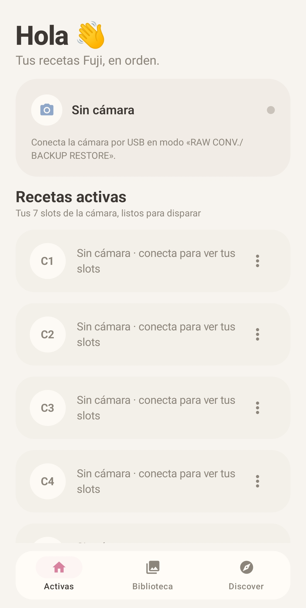
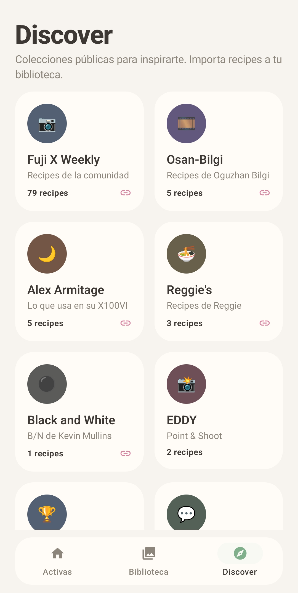
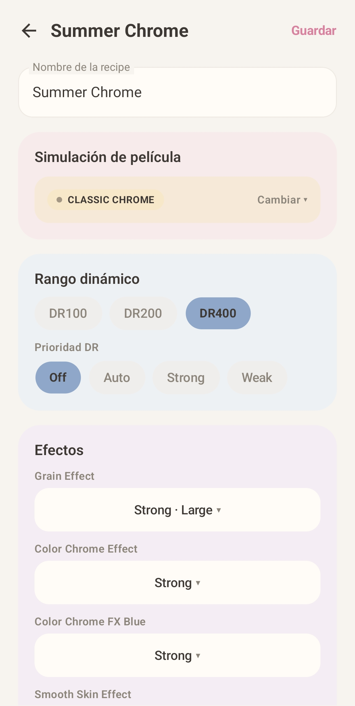

<p align="center">
  
</p>

<h1 align="center">🎞️ Fuji Recipes</h1>

<p align="center">
  <b>Lleva tus Custom Recipes a tu Fujifilm X100VI por USB</b><br>
  Descubre · Importa · Envía — todo desde tu Android
</p>

<p align="center">
  
  
  
  
  
</p>

---

## ✨ Qué es

**Fuji Recipes** es una app Android para la **Fujifilm X100VI** que lee y escribe las **7 Custom Recipes (C1–C7)** de la cámara por USB. En lugar de pelearte con los menús de la cámara, importa recipes de la comunidad, ajústalas visualmente y envíalas a la cámara con un toque.

El protocolo PTP/Fujifilm está implementado **100% en Rust** en un core independiente — el transporte más fino posible, sin comprometer el control del hardware.

## 🚀 Funciones

| | |
|---|---|
| 📷 **Perfil de cámara** | Lee y escribe C1–C7 por USB. El perfil es un espejo de la cámara: se carga al conectar, se sustituye desde tu biblioteca y se reenvía cuando quieras |
| 🗂️ **Biblioteca por colecciones** | Organiza tus recipes en colecciones (con búsqueda, multi-borrado por long-press y colección por defecto "Todas") |
| 🌍 **Discover** | **126 recipes reales** en 10 colecciones: Fuji X Weekly, 2026 Popular, Osan-Bilgi, Alex Armitage, Reggie's, EDDY, Black and White, Instagram, REDDIT… con enlaces a sus fuentes |
| ⬇️ **Importación fiel** | Cada recipe se importa con **sus valores reales** (simulación, grano, color chrome, FX blue, balance de blancos, tono, DR, NR, claridad…) parseados de su descripción |
| 🎛️ **Editor completo** | Simulación de película, grano, color chrome, FX blue, WB (modos + shift + K), curva de tono, color, nitidez, NR, claridad y *smooth skin effect* |
| 🔄 **Auto-sync** | Al abrir la app, las recipes de tu biblioteca se sincronizan con los valores reales de Discover |
| 👀 **Feedback visual** | Loader con la acción en curso, banner de éxito/error y estado por slot (enviando ✓ / error ✗) al escribir en la cámara |
| 🐞 **Diagnóstico** | Log USB/nativo integrado para depurar la conexión sin PC |

## 🖼️ Capturas

| **Activas** — tus 7 slots de cámara | **Discover** — colecciones públicas | **Editor** — recipe completa |
| :---: | :---: | :---: |
|  |  |  |

## 🛠️ Stack

```
┌─────────────────────────────────────────────┐
│  Jetpack Compose / Material 3 (Kotlin)       │  UI · navegación · estado
├─────────────────────────────────────────────┤
│  FujiUsbManager + UsbIoBridge                │  USB discovery · permisos · bulk I/O
├─────────────────────────────────────────────┤
│  Rust JNI bridge (este repo, rust/)          │  transporte Android → JSON serde
├─────────────────────────────────────────────┤
│  fuji-ptp-core (repo aparte)                 │  protocolo PTP/Fujifilm (100% Rust)
└─────────────────────────────────────────────┘
```

| Capa | Tecnología |
|---|---|
| UI | Kotlin · Jetpack Compose · Material 3 · Room |
| Bridge | Rust `cdylib` vía JNI (solo transporte + JSON) |
| Core | [fuji-ptp-core](https://github.com/AlPeFe/fuji-ptp-core) — PTP/Fujifilm en Rust, serde opcional |

**Diseño**: playful modern minimalism — blanco roto `#F7F4F0`, rosa pastel `#D982A0`, verde salvia `#7FAF8B`, cards redondeadas, barra flotante.

## 📦 Instalación

### Desde GitHub Releases (recomendado)

1. Descarga el APK de la [última release](https://github.com/AlPeFe/fuji-ptp-android/releases)
2. Instálalo (permite "orígenes desconocidos" si Android lo pide)
3. Conecta la cámara por USB en modo **USB RAW CONV./BACKUP RESTORE**

> El APK está firmado con la debug key — instala directamente sobre builds de desarrollo.

### Compilar desde el código

```bash
# Requisitos: JDK 21, Android SDK (compileSdk 35), NDK (30.x)
git clone https://github.com/AlPeFe/fuji-ptp-android
cd fuji-ptp-android

# 1) Compilar el bridge Rust → .so (arm64-v8a + x86_64)
cd rust
cargo ndk -t arm64-v8a -t x86_64 -o ../android/app/src/main/jniLibs build --release

# 2) Compilar la app
cd ../android
./gradlew assembleDebug   # o assembleRelease
```

## 📸 Uso con la cámara

1. **Conecta** la X100VI por USB (modo **USB RAW CONV./BACKUP RESTORE**)
2. Pulsa **conectar** — la app abre sesión PTP y lee C1–C7
3. **Descubre** recipes en Discover e **impórtalas** (individual, selección o colección entera — crea una colección nueva con el mismo nombre)
4. **Asigna** recipes de tu biblioteca a los slots
5. **Envía** (por slot o todas) — la cámara guarda nombre y valores
6. **Relee** cuando quieras: el perfil vuelve a ser espejo de la cámara

> 💡 La cámara y el PC no pueden estar conectados a la vez por el mismo USB — usa el móvil solo con la cámara.

## 🧪 Tests

```bash
# Core Rust (protocolo + mapeos)
cd fuji-ptp-core && cargo test --workspace

# Bridge Rust
cd rust && cargo test

# Parser de Discover (valores de recipes)
cd android && ./gradlew :app:testDebugUnitTest
```

## 🗂️ Estructura

```
android/                  # App Android (Gradle)
  app/src/main/kotlin/com/alpefe/fujiptp/
    data/                 # Room, repositorio, modelo, Discover (126 recipes)
    ui/                   # Compose: Home, Biblioteca, Discover, Editor, Diagnóstico
    FujiUsbManager.kt     # USB: discovery, permisos, bulk I/O
    FujiNative.kt         # Declaraciones JNI
rust/                     # Bridge JNI (cdylib): transporte Android → JSON
docs/                     # Logo y documentación
```

El protocolo PTP vive en **[fuji-ptp-core](https://github.com/AlPeFe/fuji-ptp-core)** (Rust). Este repo consume su feature `serde` por git:

```toml
fuji-ptp-core = { git = "https://github.com/AlPeFe/fuji-ptp-core", branch = "master", features = ["serde"] }
```

## 🐛 Problemas conocidos y fixes

- **`grain 7` en C7** → la X100VI guarda *Grain Off* como wire `7`; el core acepta `1/6/7` en lectura (arreglado en `0.1.0`)
- **Nombres corruptos al enviar** → el nombre se escribe primero en la secuencia para que no se pierda
- **Import con valores por defecto** → las recipes se sincronizan con Discover al arrancar

## 🧑‍💻 Autor

**AlPeFe** — [GitHub](https://github.com/AlPeFe)

## ⚖️ Licencia

MIT — ver [LICENSE](LICENSE). Las recipes de Discover pertenecen a sus respectivos autores (Fuji X Weekly, Osan-Bilgi, Alex Armitage, Reggie's Ballester, etc.).
